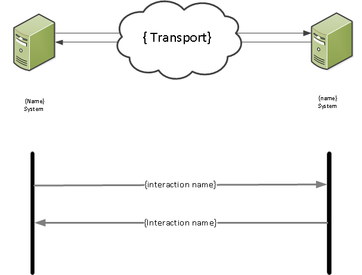

## FHIR Messaging Architecture ##

**{add domain}**

This section provides {add domain} implementers with the information required to utilise the {add domain} Domain Message Specification.

**Message Patterns and Message Structure**

The {add domain} FHIR interface is based on the [HL7 FHIR DSTU2 1.0.1 Messaging Implementation] (Sept 2015) Messaging Implementation and supports {number} interactions. 

**{interaction id}**

The sender {insert details] will construct a {insert message name} message and send it to the receiver {insert details}.

- **Sender {insert name}:** {insert system name} System
- **Receiver {insert name}:** {insert system name} System
- **Message:** Wire Format:  {insert message id} 

**Message acknowledgements and responses:**

{insert details}

**{insert domain} Interaction Diagram**

The diagram shows the {Insert Interactions}:

 

  
 

**FHIR Messaging**

The FHIR message made up of the resources is bundled within an FHIR Bundle wrapper to create the FHIR structure.

For the purpose of this implementation guide, the FHIR resources are bundled together to construct a FHIR Message payload.

In FHIR messaging, a "message" is sent from a source application to a destination application when an event happens. Events mostly correspond to things that happen in the real world. The message consists of a bundle identified by the tag "http://hl7.org/fhir/tag/message", with the first resource in the bundle being a MessageHeader resource. The MessageHeader resource has a code - the message event - that identifies the nature of the request message, and it also carries additional request metadata. The other resources in the bundle depend on the type of the request.

**XML Example of the wrapped FHIR message**

TBA

**Further Information**
  
For more information about FHIR messaging please visit: [HL7 FHIR DSTU2 1.0.1 Messaging Implementation]

[HL7 FHIR DSTU2 1.0.1 Messaging Implementation]:http://hl7.org/fhir/messaging.html

